<div align="center">

<!-- Self-Hosted Bespoke Animated Hero Banner -->


<br/><br/>

<!-- Modern Pill Badges -->
[](https://portfolio.uylonglab.xyz)
[](https://playground.uylonglab.xyz)
[](https://linkedin.com/in/song-uylong)
[](mailto:uylongsong@gmail.com)
[](https://github.com/SongUylong)

<br/>

> *“Crafting scalable microservice backends, intelligent RAG architectures, and agentic AI pipelines.”*

</div>

---

## ⚡ Executive Summary

<table>
<tr>
<td valign="top" width="60%">

### 💡 What I'm Building & Researching

- 🤖 **Agentic AI & Knowledge Retrieval:** Engineering end-to-end RAG pipelines, semantic vector search, and autonomous multi-agent toolchains.
- ⚡ **High-Concurrency Backends:** Building distributed, event-driven microservices with **Java (Spring Boot 3)**, **.NET 8**, **Laravel**, and **Kafka**.
- 🌐 **Modern Frontend Applications:** Full-stack development with **Next.js 15 (App Router)**, **TypeScript**, and **Tailwind CSS**.
- 🎯 **Academic Research:** 4th-year MIS at **Paragon International University**, aiming for Master's research in Applied AI & Distributed Systems.

</td>
<td valign="top" width="40%">

### 📌 Quick Identity

```yaml
Name:        Song Uylong
Current:
  - Full-Stack & AI @ sala.co
  - Backend & RAG @ Paragon
Education:   B.S. in MIS (Class '26)
Location:    Phnom Penh, Cambodia 🇰🇭
Target:      Systems & AI Master's
Contact:     uylongsong@gmail.com
```

</td>
</tr>
</table>

---

## 🛠️ Tech Stack & Engineering Arsenal

<div align="center">

| Domain | Visual Stack |
| :--- | :--- |
| **AI, RAG & Machine Learning** |       |
| **Backend & Microservices** |         |
| **Frontend & Web** |       |
| **Messaging & Databases** |       |
| **Cloud, DevOps & Tools** |        |

</div>

---

## 🚀 Flagship Engineering Projects

<table>
<tr>
<td valign="top" width="50%">

### 🎟️ Dropzone — Concurrency Ticketing
> *Distributed microservices event ticketing platform with zero double-booking.*

`Java 21` `Spring Boot 3` `Kafka` `Redis` `Keycloak`

- SAGA pattern distributed transactions & Redisson distributed locking.
- High-concurrency seat reservation engine.
- Complete metrics and tracing with Prometheus & Grafana.

[](https://github.com/SongUylong/dropzone)

</td>
<td valign="top" width="50%">

### 🧭 TechCompass — Career Roadmaps
> *Career development platform mapping skill gaps to industry competencies.*

`PHP 8.2` `Laravel 11` `MySQL` `TailwindCSS`

- Dynamic skill assessment quizzes & tailored career paths.
- Tech job & scholarship opportunity aggregator.
- Backed by formal university MIS research specifications.

[](https://github.com/SongUylong/techcompass)

</td>
</tr>
<tr>
<td valign="top" width="50%">

### 🦈 FinShark — Financial Valuation API
> *Stock analysis platform with live ratios, sentiment, and portfolio management.*

`.NET 8` `C#` `ASP.NET Core` `EF Core` `React`

- Live stock search & metric streams via Financial Modeling Prep API.
- Secure JWT Bearer authentication with ASP.NET Core Identity.
- User portfolio tracking and community stock commentary.

[](https://github.com/SongUylong/FinShark)

</td>
<td valign="top" width="50%">

### 🎬 Origins Studio Management System
> *Enterprise studio scheduling, equipment tracking, and access management.*

`Next.js 15` `TypeScript` `NextAuth` `Prisma` `PostgreSQL`

- Role-based access control (RBAC) & production scheduling.
- Multi-resource calendar and studio equipment booking.
- Automated client milestones and billing lifecycle.

[](https://github.com/SongUylong/OriginsStudioSystem)

</td>
</tr>
</table>

---

## 📊 GitHub Analytics & Profile Summary

<div align="center">


<br/><br/>

<table width="100%">
<tr>
<td width="50%" align="center">

</td>
<td width="50%" align="center">

</td>
</tr>
</table>

</div>

---

<div align="center">

### 📬 Let's Connect

I am always interested in discussing distributed systems, intelligent RAG architectures, and AI workflow research.

<br/>

[](mailto:uylongsong@gmail.com)
[](https://linkedin.com/in/song-uylong)
[](https://portfolio.uylonglab.xyz)

<br/>

<sub>© Song Uylong • Phnom Penh, Cambodia</sub>

</div>
